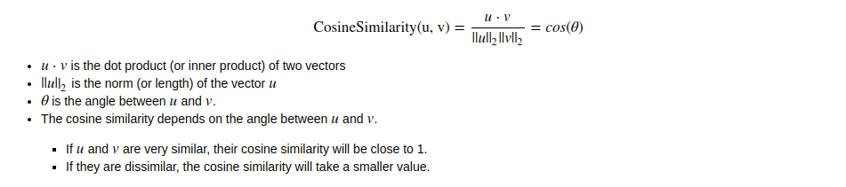
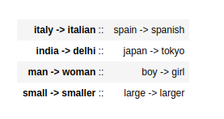

##  Word analogy Project
"a is to b as c is to __".

An example is:
'man is to woman as king is to queen' .

We are trying to find a word d, such that the associated word vectors  ea,eb,ec,edea,eb,ec,ed  are related in the following manner:
eb−ea≈ed−eceb−ea≈ed−ec 
We will measure the similarity between  eb−eaeb−ea  and  ed−eced−ec  using cosine similarity.

# 1 - Cosine similarity

To measure the similarity between two words, we need a way to measure the degree of similarity between two embedding vectors for the two words. Given two vectors u and  v , cosine similarity is defined as follows: 

Figure 1:cosine_law

Figure 2: The cosine of the angle between two vectors is a measure their similarity

Figure 3:Expected Output

